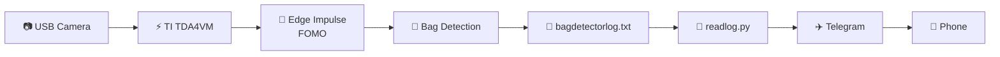
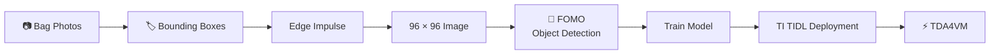
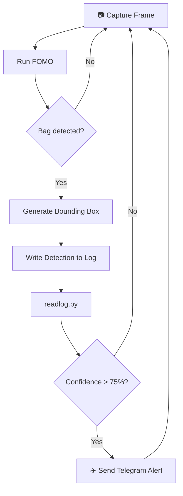

# 👜 TDA4VM Bag Detector

### Real-time bag detection with Texas Instruments TDA4VM, Edge Impulse FOMO and Telegram alerts

[](https://www.ti.com/tool/SK-TDA4VM)
[](https://www.edgeimpulse.com/)
[](https://www.python.org/)
[](LICENSE)

**Roni Bandini — Buenos Aires, Argentina — December 2022**

**TDA4VM Bag Detector** is an Edge AI computer-vision prototype that detects bags in real time using a **[Texas Instruments SK-TDA4VM](https://www.ti.com/tool/SK-TDA4VM)** and **[Edge Impulse](https://www.edgeimpulse.com/)**.

A FOMO object-detection model analyzes a USB camera stream directly on the TDA4VM hardware. Detection results are written to a log and an included Python script can filter detections by confidence and send **Telegram alerts**.

The model runs locally using the TDA4VM hardware accelerator.

---

## ✨ Features

* 📷 Real-time computer vision
* 👜 Bag object detection
* 🧠 Edge Impulse FOMO model
* ⚡ TDA4VM hardware-accelerated inference
* 📦 Prebuilt TDA4VM `.eim` model included
* 📊 Detection confidence and bounding boxes
* 🌐 Browser-based live inference view
* 📝 Inference logging
* ✈️ Telegram notifications
* 🧱 3D-printable board front
* 🔬 Public Edge Impulse model

---

# 🏗️ Architecture



The TDA4VM performs image acquisition and inference locally. Telegram is only used by the optional notification stage.

---

# ⚡ Texas Instruments TDA4VM

The project uses the **[SK-TDA4VM Starter Kit](https://www.ti.com/tool/SK-TDA4VM)**, designed for accelerated computer vision and Edge AI.

| Specification     | Value               |
| ----------------- | ------------------- |
| CPU               | Dual Arm Cortex-A72 |
| CPU frequency     | Up to 2 GHz         |
| AI performance    | **8 TOPS**          |
| AI accelerator    | C7x DSP + MMA       |
| Memory            | 4 GB LPDDR4         |
| Camera interfaces | 2× CSI-2            |
| USB               | 3× USB 3.0 Type-A   |
| Ethernet          | Yes                 |
| Display           | DisplayPort / HDMI  |

The TDA4VM also provides vision, video, DSP and GPU acceleration.

👉 **[TDA4VM product page — Texas Instruments](https://www.ti.com/product/TDA4VM)**

👉 **[SK-TDA4VM Starter Kit](https://www.ti.com/tool/SK-TDA4VM)**

👉 **[TDA4VM Linux Processor SDK](https://www.ti.com/tool/download/PROCESSOR-SDK-LINUX-SK-TDA4VM)**

---

# 🧠 Edge Impulse Model

The model is public and can be inspected or cloned:

👉 **[tda4vmBagDetector — Edge Impulse Studio](https://studio.edgeimpulse.com/public/153222/latest)**

The public project currently contains:

| Parameter           |            Value |
| ------------------- | ---------------: |
| Dataset             |    **89 images** |
| Label               |            `bag` |
| Model type          | Object Detection |
| Input               |   **96 × 96 px** |
| Validation accuracy |         **100%** |
| Test accuracy       |        **76.5%** |

The original project collected approximately **100 photographs** of different bags, positions and orientations before labeling the objects with bounding boxes.

---

# 🔬 Training Pipeline



The original training configuration used:

```text
Image size:       96 × 96
Resize mode:      Fit shortest axis
Cycles:           60
Learning rate:    0.01
Validation split: 20%
Data augmentation: Enabled
```

The Edge Impulse feature article reported approximately **97% model accuracy** during the original experiment.

👉 **[AI Joins the Loss Prevention Team — Edge Impulse](https://www.edgeimpulse.com/blog/ai-joins-the-loss-prevention-team/)**

---

# 📷 Camera

The original project used a standard USB webcam such as:

```text
Logitech C270
Logitech C920
Logitech C922
```

Connect the camera to one of the TDA4VM USB 3.0 ports.

Only one camera is required for this project, although the **[SK-TDA4VM](https://www.ti.com/tool/SK-TDA4VM)** hardware supports multi-camera configurations.

---

# 🚀 TDA4VM Setup

## 1. Install the operating system

Download the TDA4VM Linux image:

👉 **[PROCESSOR-SDK-LINUX-SK-TDA4VM](https://www.ti.com/tool/download/PROCESSOR-SDK-LINUX-SK-TDA4VM)**

Flash the image to a microSD card and boot the board.

Connect:

```text
USB camera
Ethernet
microSD
Power supply
```

The original development environment used the TI Arago Linux image.

---

## 2. Connect through SSH

Find the board IP address through your router and connect:

```bash
ssh root@TDA4VM_IP
```

The original image used:

```text
User: root
Password: empty
```

---

## 3. Install Edge Impulse Linux

The original project installation used:

```bash
npm install -g --unsafe-perm edge-impulse-linux
```

Current Edge Impulse Linux documentation:

👉 **[Edge Impulse Linux SDK](https://docs.edgeimpulse.com/hardware/deployments/run-linux)**

---

# 📦 Deploy the Model

You can clone the original public project:

👉 **[Edge Impulse Project #153222](https://studio.edgeimpulse.com/public/153222/latest)**

From Edge Impulse Deployment, build the model for:

```text
Texas Instruments
TIDL-RT Library
TDA4VM
```

The repository also contains an exported model:

👉 **[`tda4vmbagdetector-linux-aarch64-tda4vm-v5.eim`](https://github.com/ronibandini/TDA4VM-bag-detector/blob/main/tda4vmbagdetector-linux-aarch64-tda4vm-v5.eim)**

---

# ▶️ Run the Detector

The original project launches the Edge Impulse runner with TIDL acceleration:

```bash
edge-impulse-linux-runner \
  --force-engine tidl \
  --force-target runner-linux-aarch64-tda4vm \
  2>&1 | tee bagdetectorlog.txt
```

Inference output looks like:

```text
boundingBoxes 2ms.
[
  {
    "height":16,
    "label":"bag",
    "value":0.9940,
    "width":16,
    "x":64,
    "y":16
  }
]
```

The original tests reported inference around:

```text
1–2 ms
```

with TDA4VM acceleration.

---

# 🌐 Live Camera View

The Edge Impulse Linux Runner exposes a browser interface.

From a computer on the same network open:

```text
http://TDA4VM_IP:4912
```

The interface displays:

* 📷 Live camera frames
* 👜 Detected bags
* 📦 Bounding boxes
* 📊 Classification confidence

---

# ✈️ Telegram Alerts

The repository includes:

👉 **[`readlog.py`](https://github.com/ronibandini/TDA4VM-bag-detector/blob/main/readlog.py)**

The script reads:

```text
bagdetectorlog.txt
```

extracts confidence values and sends a Telegram message when a detection exceeds the configured threshold.

Default:

```python
myLimit = 75
```

which represents:

```text
75% confidence
```

---

## Configure Telegram

Create a Telegram bot using:

👉 **[@BotFather](https://t.me/BotFather)**

Telegram documentation:

👉 **[Telegram Bot API](https://core.telegram.org/bots/api)**

Then edit:

```python
apiToken = 'YOUR_BOT_TOKEN'
chatID = 'YOUR_CHAT_ID'
```

inside [`readlog.py`](https://github.com/ronibandini/TDA4VM-bag-detector/blob/main/readlog.py).

Run:

```bash
python3 readlog.py
```

A detection above the threshold generates a message such as:

```text
TDA4vm detected a bag 99%
```

---

# 🔄 Complete Flow



---

# 📁 Repository Structure

```text
TDA4VM-bag-detector/
│
├── readlog.py
├── bagdetectorlog.txt
├── tda4vmbagdetector-linux-aarch64-tda4vm-v5.eim
│
├── Demo.mp4
├── Demo2.mp4
│
├── README.md
└── LICENSE
```

Main files:

* 🐍 **[`readlog.py`](https://github.com/ronibandini/TDA4VM-bag-detector/blob/main/readlog.py)** — log parser and Telegram alerts
* 📝 **[`bagdetectorlog.txt`](https://github.com/ronibandini/TDA4VM-bag-detector/blob/main/bagdetectorlog.txt)** — sample inference output
* 🧠 **[`tda4vmbagdetector-linux-aarch64-tda4vm-v5.eim`](https://github.com/ronibandini/TDA4VM-bag-detector/blob/main/tda4vmbagdetector-linux-aarch64-tda4vm-v5.eim)** — exported model
* 🎥 **[`Demo.mp4`](https://github.com/ronibandini/TDA4VM-bag-detector/blob/main/Demo.mp4)** — project demo
* 🎥 **[`Demo2.mp4`](https://github.com/ronibandini/TDA4VM-bag-detector/blob/main/Demo2.mp4)** — additional demo
* ⚖️ **[`LICENSE`](https://github.com/ronibandini/TDA4VM-bag-detector/blob/main/LICENSE)** — MIT License

---

# 🧱 3D-Printed Front

A simple front cover was designed for the TDA4VM board:

👉 **[TDA4VM Texas Instruments Edge AI Vision Simple Cover — Thingiverse](https://www.thingiverse.com/thing:5792911)**

---

# 🌐 External References

## 🧠 Edge Impulse Expert Network

The complete official tutorial covers dataset acquisition, labeling, model training, TDA4VM deployment, browser inference and Telegram alerts.

👉 **[Deter Shoplifting with Computer Vision — Texas Instruments TDA4VM](https://docs.edgeimpulse.com/projects/expert-network/deter-shoplifting-with-computer-vision-ti-tda4vm)**

---

## 📰 Edge Impulse Blog

Edge Impulse featured the project in February 2023, covering the FOMO model, TDA4VM hardware acceleration and real-world testing.

👉 **[AI Joins the Loss Prevention Team — Edge Impulse](https://www.edgeimpulse.com/blog/ai-joins-the-loss-prevention-team/)**

---

## 🧠 Public Edge Impulse Project

The original dataset and model can be inspected or cloned:

👉 **[tda4vmBagDetector — Edge Impulse Studio](https://studio.edgeimpulse.com/public/153222/latest)**

---

## ⚡ Texas Instruments

Official TDA4VM hardware and software resources:

👉 **[SK-TDA4VM Starter Kit](https://www.ti.com/tool/SK-TDA4VM)**

👉 **[TDA4VM SoC](https://www.ti.com/product/TDA4VM)**

👉 **[Processor SDK Linux for TDA4VM](https://www.ti.com/tool/download/PROCESSOR-SDK-LINUX-SK-TDA4VM)**

---

# 🔗 Related GitHub Projects

### 🧍 TDA4VM Posture Enforcer

Computer Vision posture detection using the TDA4VM and Edge Impulse.

👉 **[github.com/ronibandini/tda4vmPostureEnforcer](https://github.com/ronibandini/tda4vmPostureEnforcer)**

### 🔎 Visual Anomaly Detection

FOMO-AD visual anomaly detection running on the Texas Instruments TDA4VM.

👉 **[github.com/ronibandini/visualAnomaly](https://github.com/ronibandini/visualAnomaly)**

### 🚦 TI AM62A AI Traffic Light

Helmet detection and traffic-light control using Edge Impulse and Texas Instruments AM62A.

👉 **[github.com/ronibandini/TIAM62AITrafficLight](https://github.com/ronibandini/TIAM62AITrafficLight)**

### 📡 Domestic ML LRAD

Human-action classification using Raspberry Pi, Edge Impulse and a Hugging Face dataset.

👉 **[github.com/ronibandini/domesticLMLRAD](https://github.com/ronibandini/domesticLMLRAD)**

---

# 📕 Contracultura Maker

**Contracultura Maker** is a book by Roni Bandini about maker culture, experimental electronics, AI, physical computing and technological autonomy.

📂 **[Contracultura Maker — GitHub repository](https://github.com/ronibandini/ContraculturaMaker)**

📕 **[Download Contracultura Maker PDF](https://github.com/ronibandini/ContraculturaMaker/raw/refs/heads/main/ContraculturaMaker2.pdf)**

---

# 📬 Contact

**Roni Bandini**
Maker · AI Developer · Writer
Buenos Aires, Argentina

* 🐙 [GitHub — @ronibandini](https://github.com/ronibandini)
* 🌐 [Medium — @ronibandini](https://bandini.medium.com/)
* 𝕏 [X / Twitter — @RoniBandini](https://x.com/RoniBandini)
* 📸 [Instagram — @ronibandini](https://www.instagram.com/ronibandini/)
* ▶️ [YouTube — @RoniBandini](https://www.youtube.com/@RoniBandini)
* 💼 [LinkedIn — Roni Bandini](https://www.linkedin.com/in/ronibandini/)

---

Built with 👜 + TDA4VM + FOMO + Edge Impulse.
